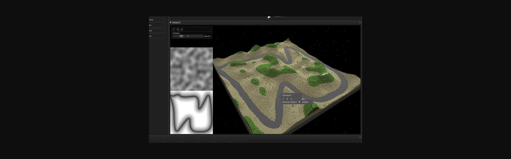

# GPU Terrain Generation & Actor Steering

### Project Preview
#### Actor Steering

#### Terrain Generation

  

## Features 📋
⚡️ Terrain Generation with the GPU, using OpenGL\
⚡️ Actor Steering\
⚡️ Editable Objects and Components\
⚡️ Easy to modify

## Installation & Deployment 📦
- Clone the repository
- Open and build using Visual Studio 2023

## Tools Used 🛠️
* <b>Krew Engine</b> - Custom, self-made engine.

## License

- **[MIT license](http://opensource.org/licenses/mit-license.php)**
